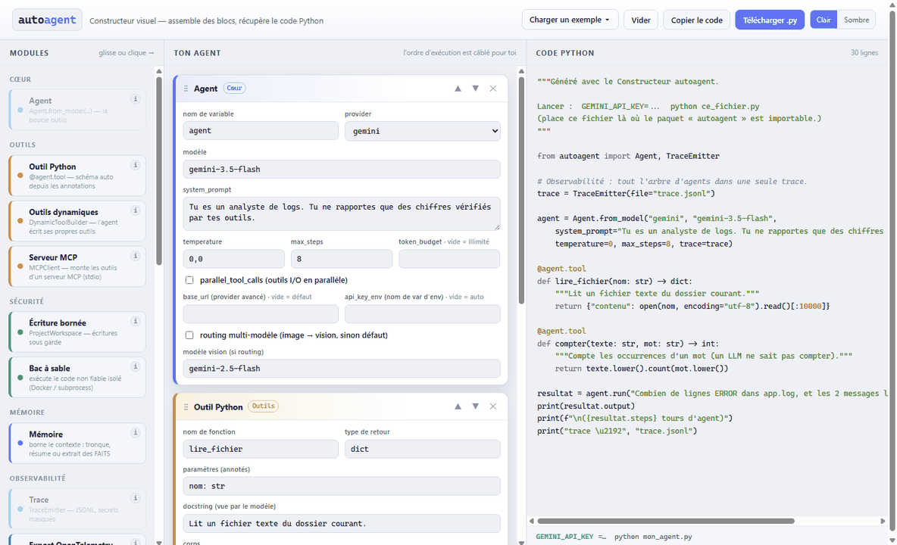

# autoagent

[](https://github.com/laazizi/autoagent/actions/workflows/tests.yml)
[](https://pypi.org/project/autoagent-core/)
[](https://laazizi.github.io/autoagent/)

**A minimal, auditable LLM agent core for Python. Not a framework.**

`autoagent` is a small library that gives you the agent loop — LLM ↔ tools, done right —
and the safety rails around it, without pulling in a framework's worldview. You can read
the entire core in an hour, and every boundary your agent has is **Python code you wrote**,
not a prompt you hope it respects.

```python
from autoagent import Agent

agent = Agent.from_model("gemini", "gemini-3.5-flash")

@agent.tool
def add(a: int, b: int) -> int:
    """Add two integers."""
    return a + b

result = agent.run("What is 21 + 21?")
print(result.output)   # "42"
```

That's the whole API for the common case. The JSON schema for `add` is generated from the
type annotations. The loop, retries, and provider wire formats are handled for you.

Prefer assembling visually? **[Try the visual builder online](https://laazizi.github.io/autoagent/)** —
drag blocks (agent, tools, memory, MCP, checkpoint…), get runnable Python. Fully offline,
also ships in the repo as `constructeur_autoagent.html`.

[](https://laazizi.github.io/autoagent/)

Need live output? Streaming is a plain sync iterator — no async ceremony:

```python
for ev in agent.run_stream("What is 21 + 21?"):
    if ev.type == "text":
        print(ev.text, end="", flush=True)      # token deltas as they arrive
    elif ev.type == "tool_start":
        print(f"\n[calling {ev.tool_name}…]")
```

---

## Why another agent library?

Because most of them are **frameworks**: they want to own your prompts, your memory, your
control flow, and your dependency tree. When something misbehaves at 2 a.m., you're reading
someone else's abstraction stack instead of your own code.

`autoagent`'s theses:

1. **The agent must be readable.** The core loop is a few hundred lines of plain Python.
   No metaclasses, no callbacks-on-callbacks, no YAML.
2. **Bounding is code, not prompts.** File access goes through `ProjectWorkspace`
   (allowlists, anti path-traversal, write history + rollback). Generated tools run in a
   **sandbox** (Docker isolation when available, hardened AST denylist otherwise) and are
   promoted to native only through a **hash-based manifest a human approves**.
3. **Zero dependencies for the core.** Python ≥ 3.10, `urllib`, `dataclasses`. No SDKs —
   each provider adapter speaks the wire format directly (~100 lines each).
4. **Multi-provider without ceremony.** OpenAI, Anthropic, DeepSeek, Gemini — plus any
   OpenAI-compatible endpoint (Kimi/Moonshot, Groq, Ollama, vLLM…) via
   `ModelConfig(base_url=…)`. A provider is one method:
   `complete(LLMRequest) -> LLMResponse`. Write your own in 50 lines.
5. **Synchronous and deterministic — with real streaming.** The loop is sync by design —
   *you* choose your concurrency model (`threading`, `asyncio.to_thread`, a queue). No
   colored functions imposed on your codebase. Streaming is a plain **sync iterator**:
   `for event in agent.run_stream(prompt): …` yields text deltas and tool events as they
   happen (SSE under the hood, all four providers).

## What's in the box

| Capability | What it gives you |
|---|---|
| **Tool schema autogen** | `@agent.tool` reads annotations + docstring → strict JSON schema (`Literal` → enums, `additionalProperties: false` by default) |
| **`ProjectWorkspace`** | bounded reads/writes: extension allowlists, anti path-traversal, change history, rollback |
| **Dynamic tools + sandbox** | the agent can write its own tools; they run in Docker (or a hardened subprocess), never natively without human promotion via a hash manifest |
| **`TraceEmitter`** | typed lifecycle events (`run_start`, `tool_call_*`, `run_end`…) with span/parent IDs → JSONL and/or callback; **secret redaction built in** (Bearer tokens, API keys never hit your logs) |
| **Streaming** | `run_stream()` / `run_messages_stream()` yield `StreamEvent`s (text deltas, `tool_start`/`tool_end`, corrections) as plain sync iterators — SSE wire streaming in all four providers |
| **`Memory` protocol** | two methods (`compact`, `recall`) — duck-typed, `@runtime_checkable`. Built-ins: `BufferMemory` (hard cap), **`SummarizingMemory`** (old turns folded into an *incremental* LLM summary), and **`FactMemory`** (atomic facts kept *up to date* via add/update/delete consolidation — a contradiction replaces the stale fact; human-readable JSON store per identity; **sleep-time consolidation** with `background=True` — `compact()` returns in <1 ms, transcript folded only after facts are saved; **semantic recall** with any host `embed_fn` — lazy batch embeddings, sidecar file, lexical fallback). `register_recall_tool()` / `register_remember_tool()` let the agent read AND write its memory as tools |
| **`RoutingProvider`** | per-request dispatch across providers: text-only turns go to a cheap model, turns carrying images route to a vision-capable one — behind the standard provider interface, invisible to `Agent` |
| **`post_turn_hook`** | host-side verification loop: inspect what the agent did, inject a correction message, hard-capped iterations — validation in code, not vibes |
| **`cancel_token`** | cooperative cancellation between LLM turns (`threading.Event`) |
| **Multimodal** | `ImageAttachment` on messages, serialized per provider |
| **`agent.as_tool()`** | the minimal multi-agent primitive: expose an agent as a tool of another (supervisor/specialist in two lines); stateless delegation, failures surface as tool errors, delegation cost (`tokens`, `steps`) reported to the parent |
| **`token_budget`** | hard cap on a run's cumulative token usage (`TokenBudgetExceeded`); per-call `TokenUsage` on results and `done` events — never invented, only what the provider reports |
| **`parallel_tool_calls`** | opt-in: multiple tool calls in one turn execute on a thread pool (I/O-bound latency win), transcript order stays deterministic |
| **`Orchestrator`** | for host-driven flows (guided forms, CATI questionnaires): *your* state machine decides every step; the LLM only interprets answers and rephrases prompts |
| **`MCPClient`** | mount any MCP server's tools as ordinary agent tools (stdio transport, zero dependencies): `mcp.mount(agent, prefix=, include=)` — server schemas validated by the registry before every call |
| **`OTelTraceExporter`** | the trace tree becomes real OpenTelemetry spans (`agent.run → llm → tool.<name>`) for Jaeger / Tempo / Langfuse / Phoenix; `opentelemetry-api` is an *optional* extra, the core stays dependency-free |
| **`RunState` + `resume`** | durable runs: a JSON checkpoint after every completed step; resume after a crash, a restart, or past a raised `max_steps` / `token_budget` (`exc.state` is ready to resume) |
| **`tool_policy`** | one hook for allow / deny / **human approval** / quota-audit, checked for every tool call *before* any side effect; a crashing policy denies (fail-closed); `ApprovalRequired` pauses the run with a resumable snapshot |
| **Taint tracking** | mark a tool's output untrusted (`@agent.tool(untrusted=True)`, `mcp.mount(untrusted=True)`) → its result is framed as data-not-instructions and the run is *tainted*; `tool_policy` sees `ctx.tainted` and can gate sensitive tools acting on externally-sourced content — **indirect prompt-injection defense as testable code**, not a probabilistic filter |
| **Record / replay** | `RecordSession` freezes a real run into a JSONL fixture; `ReplaySession` replays it deterministically — full-offline (zero network, zero tool side effects: **any real run becomes a free CI regression test, no API key**) or LLM-only (tools re-run, for debugging). A behavior change raises `ReplayMismatch` at the exact step. Pure wrappers, zero core change |
| **`EvolutionRuntime`** | let an agent modify a live project: read state, propose a module, run validation, roll back on failure |

## Quickstart

```bash
pip install autoagent-core            # installs as `import autoagent`
# or from source:
git clone https://github.com/laazizi/autoagent.git
cd autoagent
pip install jsonschema        # the core's only extra; examples may need more
export GEMINI_API_KEY=...     # or OPENAI_API_KEY / ANTHROPIC_API_KEY / DEEPSEEK_API_KEY
python examples/demo_autoagent.py      # the demo below (French prompts/comments)
```

The demo that carries the argument — one scenario, two files:

**[`examples/demo_autoagent.py`](https://github.com/laazizi/autoagent/blob/main/examples/demo_autoagent.py)** (55 lines of code) is a
**three-agent hierarchy**: an orchestrator delegates two log files to two specialist
agents (`as_tool()`), **cross-checks their findings against each other** (each
gateway-502 server error must match one FAILED payment), audits the raw files with its
own tools when in doubt, then **saves its validated report through a `ProjectWorkspace`**
fenced to `_out/` + markdown only. The whole delegation tree lands in one trace file via
a shared `TraceEmitter` — and the script ends by proving the fence deterministically,
attempting what an agent might: `../demo_autoagent.py` → *Path escapes workspace*,
`virus.exe` → *extension blocked*, `C:/Windows/x.md` → *absolute paths not allowed*.
Boundaries you can demo, because they're code.

**[`examples/demo_pure_python.py`](https://github.com/laazizi/autoagent/blob/main/examples/demo_pure_python.py)** (164 lines of code) is
the **same system with no library** — same model, same three agents, same validated
answer. Everything the library did for free, hand-rolled and annotated: the generic agent
loop, every tool schema, the provider wire format + retries, delegation with its failure
contract, the write fence, and a trace tree (without secret redaction).

| same behavior, same answer | with autoagent | pure Python |
|---|---|---|
| lines of code | **55** | **164** |
| …that you must maintain per provider | no (4 providers included) | yes |

### A tool-using agent with memory, tracing, and a verification hook

```python
import threading
from autoagent import Agent, BufferMemory, Message, ModelConfig, TraceEmitter, create_provider

provider = create_provider(ModelConfig(provider="openai", model="gpt-4o-mini"))

def must_have_saved(ctx) -> Message | None:
    """Host-side check: force another turn if the agent never wrote the file."""
    if not any(tc.name == "write_file" for tc in ctx.tool_calls):
        return Message(role="user", content="You never called write_file. Save your work.")
    return None

with TraceEmitter(file="run.jsonl") as trace:
    agent = Agent(
        provider,
        system_prompt="You are a careful refactoring assistant.",
        max_steps=12,
        memory=BufferMemory(max_messages=30),
        trace=trace,
        post_turn_hook=must_have_saved,
        max_corrections_per_run=1,
    )
    result = agent.run("Refactor ./api.py", cancel_token=threading.Event())

print(result.output, result.steps)
```

### Verdicts as tools (a pattern we use in production)

Instead of asking the model for "strict JSON" and parsing it with regexes, expose the
decision as tools — the model *cannot* answer malformed:

```python
verdict = {"decided": False}

@agent.tool
def approve(reason: str = "") -> dict:
    """The last exchange is fine."""
    verdict.update(decided=True, ok=True, reason=reason)
    return {"recorded": True}

@agent.tool
def request_fix(problem: str, instruction: str) -> dict:
    """Something is actually wrong; give the voice agent a short corrective instruction."""
    verdict.update(decided=True, ok=False, problem=problem, instruction=instruction)
    return {"recorded": True}

agent.run(state_and_transcript)
if verdict.get("ok") is False:
    deliver_instruction(verdict["instruction"])
```

This exact pattern supervises a real-time **phone bot** (Gemini Live voice loop): the
supervisor agent runs in a thread, checks every turn against the call state and the
caller's past-call memory (via `register_recall_tool`), and injects corrections — without
ever blocking the audio. The sync core made that trivial: `asyncio.to_thread(supervisor.review, …)`.

### Compose agents in two lines (`as_tool`)

No crew DSL, no choreography framework — an agent is just a tool of another agent:

```python
expert = Agent(cheap_provider, system_prompt="You are a traffic-count analyst…")
supervisor.add_tool(expert.as_tool(
    name="analyze_counts",
    description="Delegate traffic-count questions to the analyst.",
))
# Delegation is stateless, failures surface as tool errors (never crash the parent),
# and the parent sees the cost: {"output": …, "steps": 3, "tokens": 812}.
# Share one TraceEmitter and the whole hierarchy lands in a single trace tree.
```

### Keep costs bounded

```python
agent = Agent(provider, token_budget=50_000)   # hard cap per run — TokenBudgetExceeded beyond
result = agent.run("…")
print(result.usage.total_tokens)               # provider-reported, never invented
```

### Mount an MCP server's tools (two lines)

The entire MCP tool ecosystem, without wrappers — the server runs as a local
subprocess (stdio) and each of its tools becomes a regular autoagent tool,
validated against the server's own JSON Schema before anything is sent:

```python
from autoagent import MCPClient

with MCPClient(["npx", "-y", "@modelcontextprotocol/server-filesystem", "."]) as mcp:
    mcp.mount(agent, prefix="fs_", include={"read_text_file", "list_directory"})
    agent.run("List the project files and summarize the README.")
# isError results surface as tool errors (the model reacts, nothing crashes);
# transport failures raise MCPError with the server's stderr attached.
# Prefer include={...}: mounting 3 precise tools beats mounting 40.
```

### Survive crashes: checkpoint / resume

```python
import json, pathlib
from autoagent import RunState

CKPT = pathlib.Path("run_state.json")
result = agent.run(mission, checkpoint=lambda s: CKPT.write_text(json.dumps(s.to_dict())))

# …process died? restart and continue where it stopped:
state = RunState.from_dict(json.loads(CKPT.read_text()))
result = agent.resume(state)

# Budget ran out mid-run? The exception carries a ready-to-resume snapshot:
# except TokenBudgetExceeded as exc: agent.token_budget *= 2; agent.resume(exc.state)
```

### Approval gates: pause on sensitive tools, resume after a human decides

```python
from autoagent import Agent, ApprovalRequired

def policy(ctx):                                   # every tool call passes here first
    if "filesystem.write" not in (ctx.spec.permissions if ctx.spec else []):
        return None                                # allow
    if ctx.call.id not in approvals:               # your store, keyed by call id
        raise ApprovalRequired(f"{ctx.call.name}({ctx.call.arguments})")

agent = Agent(provider, tool_policy=policy)
try:
    result = agent.run("Clean up the old logs.")
except ApprovalRequired as exc:
    save(exc.state.to_dict())                      # nothing executed yet — resumable JSON
    notify_operator(exc.calls)
# …operator approves → agent.resume(state) runs the tool exactly once and finishes.
# Return a str from the policy to DENY with a reason the model can react to.
# A crashing policy DENIES (fail-closed): this hook is a security boundary.
```

### See your runs in Jaeger / Langfuse (OpenTelemetry)

```python
from autoagent import TraceEmitter, OTelTraceExporter   # pip install autoagent[otel]

with OTelTraceExporter() as exporter:                     # uses the global OTel tracer
    trace = TraceEmitter(file="trace.jsonl", on_event=exporter)   # JSONL + OTel spans
    agent = Agent(provider, trace=trace)
    agent.run("…")
# agent.run → llm → tool.<name>, with durations, statuses and redacted payloads.
# A broken OTel backend can never break the agent loop.
```

## Recipes

### A file-editing agent that can't escape its box

```python
from autoagent import Agent, ProjectWorkspace

ws = ProjectWorkspace("./my_app/src", allowed_write_extensions={".py", ".json"})

@agent.tool
def read_file(path: str) -> dict:
    return ws.read_file(path)

@agent.tool(permissions=["filesystem.write"])
def write_file(path: str, content: str, reason: str = "") -> dict:
    return ws.write_file(path, content, reason)     # history kept per change

@agent.tool(permissions=["filesystem.write"])
def rollback() -> dict:
    return ws.rollback_last_change()                # tests failed? undo.

agent.run("Rename the config loader and update its imports.")
```

If the model tries `write_file("/etc/passwd", …)` or `../../secrets.env`, the workspace
raises — the model sees `{"error": "Path escapes workspace"}` and course-corrects. Every
write is journaled (`ws.list_changes()`) and individually revertible. **The boundary is
code you can unit-test, not a system-prompt plea.**

### A chat that never forgets (in a bounded context)

```python
from autoagent import Agent, SummarizingMemory

agent = Agent(
    provider,
    memory=SummarizingMemory(cheap_provider, max_messages=40, keep_recent=12),
)
agent.register_recall_tool()      # the model gets a `recall(query)` tool

# 500 messages later: old turns live in an *incrementally updated* LLM summary
# (one cheap call per compaction — never a full re-synthesis), the last 12 stay
# verbatim, and when the user asks "what was that flag I mentioned yesterday?"
# the model calls recall("flag") over the folded history by itself.
```

If the summarizer call ever fails, compaction is skipped for that turn — context grows
temporarily instead of being silently truncated. Failure modes are boring on purpose.

Measured, not promised: the repo ships a behavioral memory eval
([`evals/`](evals/)) — 12 multi-session scenarios (facts established in past
calls, then contradicted or made stale, then queried in a *fresh* session).
**`FactMemory` + recall: 12/12 · no memory: 0/12 · rolling summary: 0/12**
(a rolling summary is *conversation* memory by design — it doesn't survive a new
session; `FactMemory` is *identity* memory). Run it yourself:
`python evals/eval_memoire.py`.

### Route images to a vision model, keep text on the cheap one

```python
from autoagent.providers.routing import RoutingProvider

agent = Agent(RoutingProvider(
    default=create_provider(ModelConfig(provider="deepseek", model="deepseek-chat")),
    vision=create_provider(ModelConfig(provider="gemini",  model="gemini-3.5-flash")),
))
# Text turns → DeepSeek. A turn carrying an ImageAttachment → Gemini.
# Past image parts are stripped for the text model (which would crash on them).
# The Agent never knows: it's just an LLMProvider.
```

Custom policies are one lambda away: `router=lambda req: big if is_long(req) else small`.

### The agent writes its own tools — without owning your machine

```python
from autoagent import Agent, DynamicToolBuilder

agent = Agent(manager_provider, max_dynamic_tools_per_run=3)
agent.enable_dynamic_tools(DynamicToolBuilder(coder_provider, tools_dir="./tools_dyn"))

agent.run("Read ./access.log and give me the top 5 most-hit URLs.")
# The model decides it needs a counter → calls create_python_tool(...)
# → a second LLM writes the code → AST denylist screens it (no eval/exec,
#   imports filtered by declared permissions) → it runs in a sandbox
#   (Docker when available, hardened subprocess otherwise)
# → promotion to native execution requires a HUMAN adding its hash
#   to the tool manifest. Convenience without the YOLO.
```

### Host-driven flows the LLM cannot derail

For questionnaires, guided forms, onboarding — where skipping a step is a bug, not
creativity — `Orchestrator` inverts the roles: **your state machine** owns the flow, the
LLM only interprets answers and rephrases prompts:

```python
from autoagent.orchestrator import Orchestrator, Step

answers = {}
def current_steps():          # your code decides what's next — always
    todo = [f for f in ("name", "age", "city") if f not in answers]
    return [Step(id=f, payload={"ask": f}) for f in todo[:2]]

def record(step_id, value):   # your code validates — return an error string to reject
    answers[step_id] = value
    return None

orch = Orchestrator(provider, current_steps=current_steps, record=record)
for ev in orch.turn("I'm Ana and I'm 30"):
    if ev.type == "text":     print(ev.text, end="")     # streamed, rephrased nicely
    elif ev.type == "recorded": log(ev.step_id, ev.value)  # name AND age, one utterance
```

We run this pattern in production against a live phone line: the deterministic flow
records the answers, a supervisor agent (the "verdicts as tools" pattern above) audits
every turn in parallel, and `SummarizingMemory`-style per-caller memory makes the bot
recognize people who call back.

## How it compares

Honest positioning — these tools optimize for different things, and several of them are
excellent at what they do:

| | **autoagent** | LangChain / LangGraph | CrewAI | AutoGen | OpenAI Agents SDK | smolagents |
|---|---|---|---|---|---|---|
| **Core size** | ~6k LOC total, core loop readable in an hour | very large | large | large | medium | small |
| **Core dependencies** | **0** (stdlib) + `jsonschema` | many | many | many | `openai` sdk | `huggingface_hub` etc. |
| **Providers** | OpenAI, Anthropic, DeepSeek, Gemini — raw wire, no SDKs | very many (via integrations) | via LiteLLM | via extensions | OpenAI-first | via LiteLLM |
| **Control flow** | your Python (`run` / `run_messages` / `Orchestrator` for host-driven flows) | graphs/chains DSL | role/crew abstraction | multi-agent conversation | handoffs | code-as-actions |
| **Security model** | **code-level**: bounded workspace, Docker/AST sandbox, hash-manifest tool approval | per-integration | limited | limited | guardrails (model-level) | sandboxed code exec |
| **Observability** | typed trace events + **built-in secret redaction**, zero deps | LangSmith (SaaS) | ext. | ext. | OpenAI tracing | basic |
| **Streaming** | ✅ sync iterators (`run_stream`, text deltas + tool events, SSE in all providers) | ✅ | ✅ | ✅ | ✅ | partial |
| **Async (asyncio)** | ❌ sync by design — wrap with threads (`asyncio.to_thread`) | ✅ | ✅ | ✅ | ✅ | partial |
| **Multi-agent** | ✅ minimal primitive: `agent.as_tool()` (supervisor → specialist delegation, shared trace tree); no crew/choreography DSL | ✅ graphs | ✅ core feature | ✅ core feature | ✅ handoffs | ✅ `managed_agents` (hierarchical) |
| **Memory / RAG** | ✅ buffer, incremental summarizing, and **fact memory** (Mem0-style extract-and-consolidate: contradictions *replace* stale facts) with **sleep-time consolidation** (off the critical path) and **semantic recall** (plug any `embed_fn`); full vector RAG stack = bring your own (2-method protocol) | ✅ full RAG stack | ✅ | partial | partial | partial |
| **Multi-provider routing** | ✅ per-request (text → cheap model, images → vision model) | via config | via LiteLLM | via config | ❌ OpenAI-first | via LiteLLM |
| **MCP tools** | ✅ zero-dep stdio client, server schemas validated locally | ✅ | ✅ | ✅ | ✅ | ✅ |
| **Durable runs (checkpoint/resume)** | ✅ JSON `RunState` per step, `resume()` after crash or raised budget | ✅ LangGraph checkpointers | ✅ Flows `@persist` | partial (state save/load) | ✅ `RunState` to/from JSON + HITL interruptions | ❌ |
| **OpenTelemetry export** | ✅ optional extra, spans mirror the trace tree | via ext. | via ext. | ✅ | via ext. (tracing processors) | ✅ via openinference |
| **Best when** | you want to **own and audit** the loop; embed agents in an existing app; strict tool bounding | you want the ecosystem | role-played crews fast | conversational multi-agent research | you're all-in on OpenAI | HF ecosystem, code agents |

### When you should NOT use autoagent

- You need a **native asyncio pipeline** (the loop and streaming are sync iterators — wrapping
  them in threads is easy, but if your whole stack is `async/await`, friction adds up).
- You want **turn-key vector RAG** or hundreds of prebuilt integrations — LangChain's ecosystem is unmatched.
- You need rich **multi-agent choreography** (roles, negotiation, group chats) as a first-class
  framework feature — here you get one honest primitive (`as_tool`) and compose the rest.
- You don't want to write any Python around your agent.

If, instead, your agent is a **component inside a real application** — where you need to
know exactly what it can touch, log exactly what it did, and debug it by reading code —
that's the niche this library is built for.

## Security posture: sobriety is a feature

If your agent touches sensitive data (PII, credentials, internal databases), the size of
your stack *is* part of your attack surface. autoagent's position, in verifiable facts:

- **Supply chain you can actually audit.** `pip install autoagent-core` installs the
  standard library plus `jsonschema` — that's the entire tree. Mainstream agent
  frameworks pull in dozens to hundreds of transitive packages; every one of them is a
  potential compromise, typosquat, or breaking release you now own. Here, one afternoon
  of reading covers 100 % of the code that runs.
- **Nothing phones home.** No telemetry, no SaaS backend, no account. Providers are
  called over raw HTTPS to the endpoints *you* configure — the only network traffic is
  the traffic you asked for. Observability is a local JSONL file and/or *your* OTel
  collector.
- **Secrets are scrubbed at the source.** Every trace preview and recall snippet passes
  a redaction filter (Bearer tokens, API keys) before it can reach a log, a file, or an
  external backend.
- **Untrusted code never runs free.** Agent-written tools go through AST screening, then
  a Docker sandbox (no network, read-only FS, non-root); promotion to native execution
  requires a human-approved hash manifest, and one changed byte revokes it.
- **The human stays in the loop by construction.** `tool_policy` is fail-closed: a
  crashing policy denies. Sensitive calls pause *before* any side effect and resume only
  after approval.
- **Indirect prompt injection is bounded by code.** Tools that read external content
  (web, email, third-party MCP servers) are marked `untrusted`; their output is framed as
  data-not-instructions and taints the run. Your policy can then refuse to let a
  *tainted* run drive a sensitive tool — so a poisoned web page cannot make the agent
  exfiltrate, even if the model falls for the trick. Demonstrated deterministically in
  `examples_autoagent/20_injection_dejouee.py`.

None of this makes an agent "secure" by itself — but it means the boundaries are code
you can unit-test and audit, not behaviors you hope for.

## Design notes

- **One loop to understand**: send history + tool specs → LLM answers text (done) or tool
  calls → execute locally → append results → repeat, hard-capped by `max_steps`.
- **Errors are data**: a tool that raises returns `{"error": "…"}` to the model, which
  gets a chance to recover. A broken `Memory` or hook is logged and bypassed — never fatal.
- **Every preview is redacted**: trace payloads and recall snippets pass through the same
  secret-scrubbing filter (`Bearer …`, `api_key`, `?key=` patterns).
- **Providers are boring on purpose**: request in, response out. `reasoning_content`
  round-tripping (DeepSeek thinking / o-series) and `max_completion_tokens` quirks are
  handled inside the adapter so your code stays clean.

## Project status

Used in production internally (survey/phone-bot supervision at Alyce). API surface is
small and stable; version-tagged features are documented in [the developer guide](https://github.com/laazizi/autoagent/blob/main/autoagent-dev-doc.md).
Contributions welcome — especially provider adapters, `Memory` backends, and sandbox hardening.

## License

MIT (see `LICENSE`).
